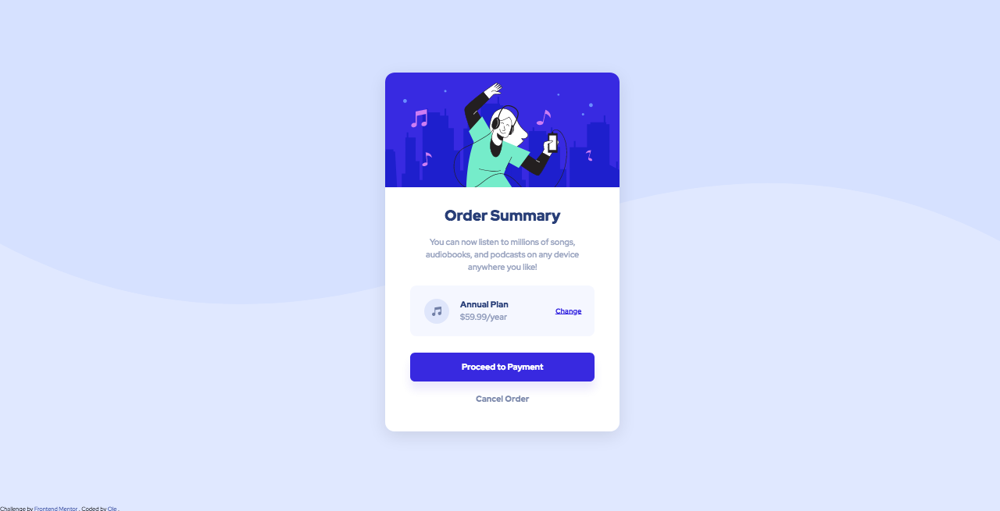
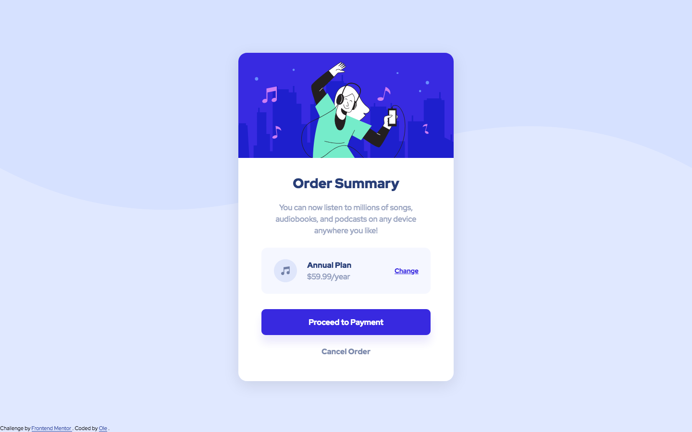

# Frontend Mentor - Order summary card solution

This is a solution to the [Order summary card challenge on Frontend Mentor](https://www.frontendmentor.io/challenges/order-summary-component-QlPmajDUj). Frontend Mentor challenges help you improve your coding skills by building realistic projects.

## Table of contents

- [Overview](#overview)
  - [The challenge](#the-challenge)
  - [Screenshot](#screenshot)
  - [Links](#links)
- [My process](#my-process)
  - [Built with](#built-with)
  - [Continued development](#continued-development)
- [Author](#author)

## Overview

### The challenge

Users should be able to:

- See hover states for interactive elements

### Screenshot

##### Mobile

##### Laptop

##### Desktop

### Links

- Solution URL: [https://github.com/owi92/order-summary-component-main](https://github.com/owi92/order-summary-component-main)
- Live Site URL: [https://owi92.github.io/order-summary-component-main/](https://owi92.github.io/order-summary-component-main/)

## My process

### Built with

- CSS Grid (for pricing-area)
- Mobile-first workflow

### Continued development

I first focused on the mobile design and then tried to scale everything to fit the desktop design by using `min(vw,rem)` for the smaller and larger design respectively.
Once I got things looking the way I wanted them to I realized that the design was displayed a bit too large on my own laptop screen.
To solve this I tried using `clamp(minWidth,variableWidth,maxWidth)` but couldn't really get it to work, so I ended up using a bunch of media-queries instead.
In future projects I plan to figure out the clamp()-function and also use a framework to help with responsive design.

## Author

- Frontend Mentor - [@owi92](https://www.frontendmentor.io/profile/owi92)
